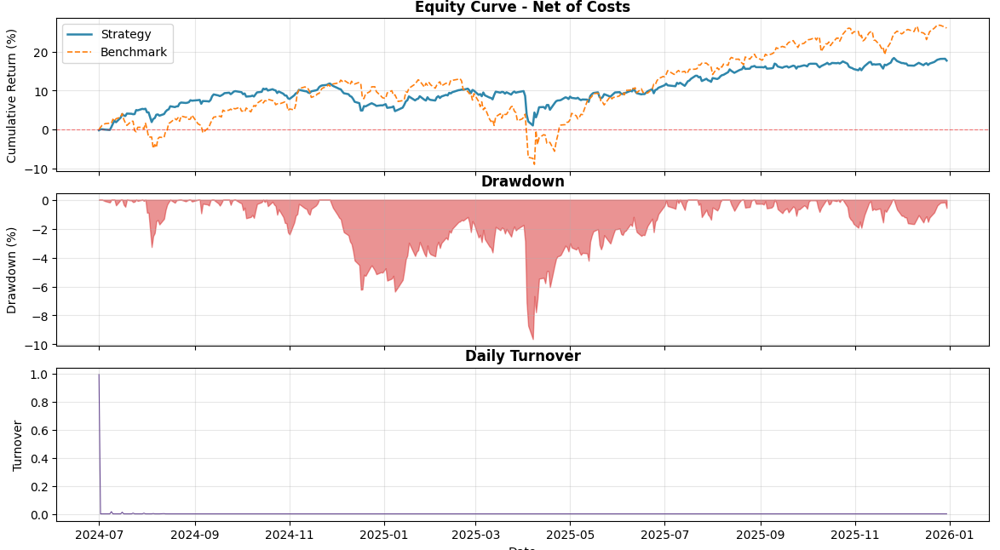
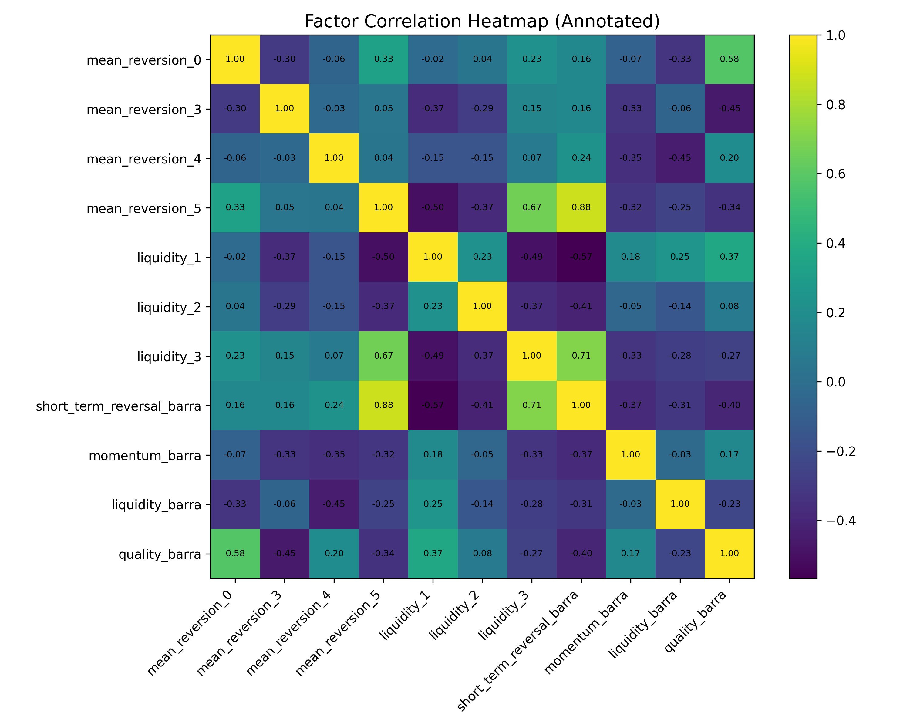

# Traders@UST Quant (Basic) Team - Multi-factor model

A quantitative multi-factor strategy developed by the Traders@UST Quant (Basic) Team in spring 2026 for the US market in partnership with Massive.com. Full report can be seen [here](Traders%20Quant%20(basic)%20Final%20Report%2025-26%20Spring.pdf).

## Overview

**Model:** A cross-sectional linear regression framework to predict excess returns, paired with a Barra-style risk model to decompose systematic and idiosyncratic risk.<br>
**Universe:** All US stocks with NaN values less than 50%<br>
**Alpha signals:** Momentum/mean-reversion and liquidity. (Fundamentals excluded due to data sparsity and reporting lags.)<br>

| Net annual return | Sharpe ratio | Max drawdown | Information ratio |
| --- | --- | --- | --- |
| 11.24% (benchmark: 16.64%) | 1.246 | -9.64% | -0.258 |

## Quick start

### 1. Prerequisites
Ensure you have Python 3.12.3+ installed on your system. 

### 2. Clone the Repository
```bash
git clone https://github.com/oscartheveggie/traders-quant-beginner-factor-model.git
cd traders-quant-beginner-factor-model
```

### 3. Set Up Virtual Environment
Create and activate a virtual environment to manage your dependencies cleanly.

**On macOS/Linux:**
```bash
python3 -m venv venv
source venv/bin/activate
```

**On Windows:**
```bash
python -m venv venv
venv\Scripts\activate
```

### 4. Install dependencies

```bash
pip install -r requirements.txt
```

## Usage

### 1. Getting all stocks daily data and cleaning

Go to `/src/data-fetchers/data-fetcher-massive.py` for Massive.com, or `/src/data-fetchers/data-fetcher-yfinance.py`, change global settings, and run the python file.

If you use Massive.com, copy the `.env.template` and make it into a `.env`. Then, input your Massive.com REST client API key there.

To clean data, use `cleaning.py`. Choose what cleaning functions to run using the `options` variable in `main()`.

### 2. Inputting and evaluating factors

Input helper functions in `functions.py` and input actual factors in `factors.py`. Follow the instructions on the top of both python files.

To evaluate factors, run `evaluator.py`. If you want to run specific factors only, input them in the `custom_factor_list` list on top of the file.

### 3. Regression, portfolio optimization and backtesting

Run `run_backtest.py`. If you wish to generate factor returns, covariance matrix and portfolio weights, uncomment section 2.

## Methodology

### Datasets

Date range: **2016-01-01 to 2025-12-31** <br>
Train / CV / test set proportion: **70% / 15% / 15%**<br>
Universe of stocks: All US stocks with NaN values less than 50%

Data source:
- **Massive.com**: All US stocks price and fundamentals data
- **yFinance**: Benchmark and risk-free rate data

### Model for excess returns: Cross-sectional linear regression

We model excess stock returns $R_{it}$ for security $i$ at time $t$ as $\sum_{j=1}^{k} f_j X_{(i,j)t} + u_{it}$, where:
- $f_j$ is the _factor return_ (i.e., the regression coefficient) of factor $j$
- $X_{(i,j)t}$ is the _factor exposure_ (i.e., factor's numerical value) of factor $j$ of security $i$ at time $t$
- $u_i$ is the _specific return_ (i.e., the alpha) of security $i$.

This becomes $\vec{R} = X\vec{f}+\vec{u}$ in matrix form, with each row being a specific time $t$.

So to predict expected excess returns, we have $E( \vec{R}) = X E(\vec{f})+E(\vec{u}) $. We find $E(f)$ by regressing over all timestamps and taking their average.

To prevent model overfitting, we use elastic net regularization to identify and combine redundant factors, and use L2 regularization to smooth out our model. However, the code for this has not yet run and may have bugs.

### Model for risk: Barra factor risk model

From above, we have $Var(R_i) = Var(\vec{X_i}f + u_i) = Var(\vec{X_i}f) + Var(u_i)$, which becomes $\Sigma = XFX^T+\Delta$, where:

- $\Sigma$ is the covariance matrix of excess returns
- $X$ is the factor exposure matrix as aforementioned
- $F$ is the covariance matrix for factor returns. Each entry $F_{ij} = \sigma_{f_i,f_j}$.
- $\Delta$ is the diagonal matrix with entries $\sigma_{u_i}^2$.

### Portfolio optimization

After obtaining excess returns and the covariance matrix, we allocate weights to all US stocks by maximizing utility function $U = E(R_p) - \frac{1}{2}A\sigma_p^2$, taking $A=2.5$.

### Code implementation

In the `regression.py` file, we:
1. Calculate the historical factor exposures using the `FactorEngine` class. 
2. Obtain $f$ and $u$ using the `RegressionModel` class.
3. Get the covariance matrix from the `RiskModel` class.
4. Optimize portfolio using the `PortfolioOptimizer` class.

This is then used to backtest using the `run_backtest.py` script.

## Results

For a 5-day timeframe, we achieved the following results:

| Metric | Result |
| --- | --- |
| Total return | 17.69% (vs benchmark 26.05%) |
| Annual return (net) | 11.24% (vs benchmark 16.64%) |
| Annual return (gross) | 11.41% |
| Cost drag (annual) | 0.17% |
| Annual volatility | 9.02% |
| Sharpe ratio | 1.246 |
| Sortino ratio | 1.511 |
| Max drawdown | -9.64% |
| Ulcer index | 0.0235 |
| UPI | 4.786 |
| Average daily turnover | 0.003 |
| Periods | 379 |






## Directory structure

```text
traders-quant-beginner-factor-model/
├── .vscode/
│   └── settings.json          
├── data/
|   ├── benchmark.csv                   # Russell 3000 index as benchmark
|   ├── example.csv                     # Mag 7 price data
|   ├── rf_rate.csv                     # Risk-free rate (13-week T-bill yield) data
|   └── (other git-ignored large csv and parquet files)
├── src/
│   ├── data-fetchers/                  # folder of data fetching scripts
│   │   ├── cleaning.py                 # data cleaning script
|   |   ├── data-fetcher-massive.py     # fetcher from Massive.com api
|   |   └── data-fetcher-yf.py          # fetcher from yfinance api
│   ├── backtest.py                     # backtester class
│   ├── datasets.py                     # datasets class, for obtaining train, test, cv sets quickly
│   ├── evaluator.py                    # functions for evaluating factors
│   ├── factors.py                      # factor functions
│   ├── functions.py                    # operators and helper functions
│   ├── regression.py                   # regression, risk model, portfolio optimization pipeline
│   ├── run_backtest.py                 # Wrapper script for running backtest
│   ├── test_backtest.py                # Test script for backtesting logic
│   └── walk_forward_cv.py              # (not yet tested, may contain bugs) Regularization using walk-forward CV
├── .env.template                       # template for .env file
├── README.md
├── requirements.txt
└── Traders Quant (basic) Final Report 25-26 Spring.pdf
```

## Contributors

* Oscar Tsoi ([oscartheveggie](https://github.com/oscartheveggie)) (HKUST QFIN '28) - Team Lead
* Bryan Chua ([comiiiiii](https://github.com/comiiiiii)) (HKUST QFIN '29) - Team member
* Jacky Liu ([abai82](https://github.com/abai82)) (HKUST GBUS '29) - Team member
* Wilson Orlando ([Amazfhing](https://github.com/Amazfhing)) (HKUST DSCT '28) - Team member

**Special thanks**
* Lincoln Liang (HKUST IS '28) - Quant team supervisor
* Jerry Wong (HKUST DDP '29) - Massive.com sponsorship coordinator

## License

This project is licensed under the MIT License - see the [LICENSE](LICENSE) file for details.
